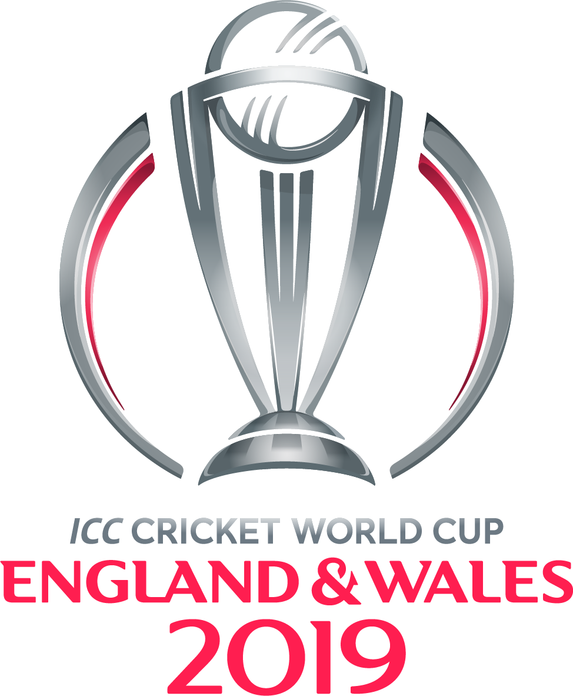

## ICC World Cup 2019 winner prediction

### Motivation

Cricket is an integral part of every Indian's life. I have following cricket since childhood.Now that I entered the field of Data Science I thought of making use of my machine learning and web scraping skills to predict the winner of ICC world cup 2019.

### Data
The primary source of data for this project is ESPNcricinfo.com. The website is truly unparalleled in terms of the wealth of statistics it possesses. Scripts will scrape one-day international matches', players' and grounds' details.

Secondary sources of data will include a weather application and others (TBD at this point).

### References :

Motivation : [Using artificial intelligence to predict 2019 Cricket World Cup](https://www.sportskeeda.com/cricket/ai-prediction-for-2019-cricket-world-cup)

Data source : [espncricinfo](http://www.espncricinfo.com/)

  

